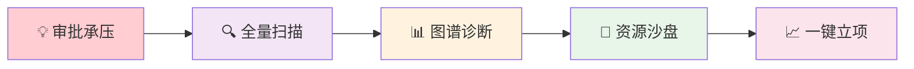
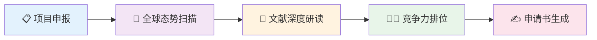

# 科技情报挖掘与知识服务系统 — 用户·场景·价值说明

> **项目**：深圳市科技创新局国际科技信息中心  
> **子系统**：科技情报挖掘与知识服务  
> **定位**：全球首个面向政府科技决策的AI原生科技情报中枢

---

## 一、系统用户对象总览

本系统面向科技创新链上 **五类核心用户**，覆盖"决策—分析—管理—科研—产业"全环节：

| 代号 | 用户角色 | 典型代表 | 核心诉求 | 使用频次 |
|:----:|----------|----------|----------|:--------:|
| 🔴 U1 | **科技局决策者** | 张局长（48岁，博士，20年管理经验） | 全局态势感知、精准引才、数据驱动决策 | 高频决策场景 |
| 🟢 U2 | **科技情报分析师** | 李研究员（35岁，硕士，情报学专业） | 高效整合多源数据、AI辅助分析报告 | **最高频核心用户** |
| 🟠 U3 | **科研管理者** | 周处长（42岁，硕士，科技管理背景） | 计划全周期管理、资助效果量化评估 | 中频管理场景 |
| 🔵 U4 | **高校科研人员** | 王教授（38岁，海归博后，AI方向） | 跨学科检索、合作者发现、AI辅助科研 | 高频科研场景 |
| 🟣 U5 | **产业研究员** | 陈博士（32岁，博士，新材料方向） | 产业链分析、技术竞争情报、专题研究 | 中高频分析场景 |

> [!NOTE]
> 🟢 **李研究员（U2）** 是本系统最核心的高频深度用户——系统的情报采集、深度分析、自动报告等能力均围绕其工作流设计。  
> 🔴🟢🔵 三类用户在整个平台中跨 5-6 个子系统复现，证明本系统作为"情报中枢"的战略枢纽地位。

---

## 二、五类用户的典型场景与产品价值

> **颜色约定**：场景中涉及 🔴决策对象 🟢情报对象 🔵科研对象 🟣产业对象 🟠管理对象 时，以对应颜色标注，直观体现多业务对象的交叉协同。

---

### 场景一：🔴 决策者「张局长」—— 一次10亿级科技投资的立项论证

**背景**：市领导要求论证10亿级"量子计算研究院"的立项可行性，发改委与财政局将严格质询。



| 阶段 | 张局长的行为 | 系统能力 | 涉及业务对象 | 💎 产品价值 |
|------|-------------|---------|:-----------:|-----------|
| **① 审批承压** | 输入战略命题："量子计算研究院可行性" | 自然语言理解，自动拆解为可量化的子检索任务 | 🔴决策 🟢情报 | **战略意图秒级解构**——将"该不该建"转化为"实力几何、缺谁、能引谁" |
| **② 全量扫描** | 发起全球对标扫描 | 基于1.5亿文献+1亿专利，统计对比各阵营真实核心影响力 | 🔴决策 🟣产业 🔵科研 | **超越人工的颗粒度**——全球技术力量100%覆盖比对 |
| **③ 图谱诊断** | 查阅卡脖子诊断分析 | **引用溯源网络** 穿透底层引用链，精准定位技术空白 | 🔴决策 🟢情报 🟣产业 | **刺破宏观迷雾**——直击具体卡脖点的根源归属 |
| **④ 资源沙盘** | 查阅人才班底可行性 | **隐含关联挖掘** 计算本土团队与目标人才之间的非显性学术连通路径 | 🔴决策 🔵科研 🟢情报 | **以数据替代专家背书**——算得出"研究院批下来，人能不能聚齐" |
| **⑤ 一键立项** | 审核并导出论证报告 | Agent 30分钟自动成稿，每条结论附带数据溯源链接 | 🔴决策 🟢情报 | **省去两个月调研起草**——带实证溯源的严谨报告 |

> **效率对比**：传统方式 2个月+ → 本系统 **不到1小时**

---

### 场景二：🟢 情报分析师「李研究员」—— 一份决定数百亿资金流向的产业体检报告

**背景**：省科技厅紧急要求两周内上报《新能源产业链自主可控度白皮书》，直接决定数百亿产业资金走向。


| 阶段 | 李研究员的行为 | 系统能力 | 涉及业务对象 | 💎 产品价值 |
|------|-------------|---------|:-----------:|-----------|
| **① 战略命题** | 输入产业链分析命题 | **情报规则引擎** 自动拆解为6大环节×N技术节点的动态检索规则矩阵 | 🟢情报 🟣产业 | **复杂命题秒级拆解**——模糊政策需求→可执行分析框架 |
| **② 专利链穿透** | 发起全球专利链扫描 | 穿透1亿件全球消歧专利，算出每环节真实占有率（如电解质仅7%） | 🟢情报 🟣产业 🔴决策 | **专利级产业体检**——精确到每环节被谁卡、卡多深 |
| **③ 可控测算** | 查阅各环节可控指数 | 5000万实体消歧过滤"注水专利"和"僵尸机构"，还原真实竞争力 | 🟢情报 🟣产业 | **数据防污染**——过滤注水后的结论经得起答辩 |
| **④ 威胁预警** | 系统弹出红色预警 | **隐含关联挖掘** 发现某日企通过壳公司的专利包围+核心学者离职——两个孤立事件被系统关联成完整威胁地图 | 🟢情报 🟣产业 🔵科研 🔴决策 | **看见暗处的棋局**——把孤立巧合拼成系统性威胁预警 |
| **⑤ 白皮书生成** | 审核并导出白皮书 | Agent 2小时自动生成带完整专利溯源的白皮书初稿 | 🟢情报 🔴决策 | **两周的活两小时交卷**——每条结论有专利链接可追溯 |

> **效率对比**：传统方式 2个月+ → 本系统 **2小时**

---

### 场景三：🔵 高校科研人员「王教授」—— 让千万级国家项目不再"倒在综述上"

**背景**：王教授申报千万级国家基金重大研究计划，"国际竞争力分析"章节是历年被毙的头号原因。



| 阶段 | 王教授的行为 | 系统能力 | 涉及业务对象 | 💎 产品价值 |
|------|-------------|---------|:-----------:|-----------|
| **① 项目申报** | 设定研究方向 | 自动拆解为细分技术节点，生成结构化检索策略 | 🔵科研 | **从模糊方向到精准检索**——不再漏掉交叉学科文献 |
| **② 全球态势扫描** | 发起跨学科文献检索 | **引用溯源网络** 穿透1.5亿文献，倒查引用链召回跨语种根基性文献 | 🔵科研 🟢情报 | **跨学科零盲区**——评审专家挑不出"遗漏了重要工作" |
| **③ 文献研读** | 选中核心综述 | AI全息伴读：结构化提取创新点、实验数据、局限性，中文对比展示 | 🔵科研 | **3天苦读变30分钟**——精确掌握全球"做到哪了、卡在哪了" |
| **④ 竞争力排位** | 查看全球团队排位 | **隐含关联挖掘** 跳过高产但浅交叉的"名人"，精准锁定互补性合作者 | 🔵科研 🟢情报 🟣产业 | **数据驱动的竞争力论证**——发现"谁最值得联手" |
| **⑤ 申请书生成** | 审核导出申请书章节 | Agent整合分析结果自动生成初稿，附完整引文溯源 | 🔵科研 🟢情报 | **评审级别的严谨度**——每条论断有数据支撑 |

> **效率对比**：传统方式 3个月 → 本系统 **1小时**

---

### 场景四：🟠 科研管理者「周处长」—— 科技资助效果的精准量化

**背景**：年度绩效考核，需评估全市科技计划资助的实际产出效果。

| 阶段 | 周处长的行为 | 系统能力 | 涉及业务对象 | 💎 产品价值 |
|------|-------------|---------|:-----------:|-----------|
| **① 项目盘点** | 查看在管项目执行情况 | 系统自动关联项目与对应产出（论文/专利/成果转化） | 🟠管理 🟢情报 | **每个项目产出一屏看完** |
| **② 效果评估** | 评估各方向资助效能 | 基于知识图谱量化"投了多少→产了多少"，计算投入产出比 | 🟠管理 🟣产业 🔴决策 | **"投了5000万→23项专利、12项转让"** |
| **③ 趋势发现** | 找下一年度资助重点 | **隐含关联挖掘** 自动发现哪些团队正在崛起、哪些方向处于红利期 | 🟠管理 🔵科研 🟢情报 | **提前布局潜力赛道**——AI帮你发现"谁在崛起" |
| **④ 风险预警** | 审查在途资金异常 | 实时监控资金流向，异常自动预警 | 🟠管理 🔴决策 | **科技资金"零风险"** |

---

### 场景五：🟣 产业研究员「陈博士」—— 产业链全景穿透分析

**背景**：撰写合成生物学产业发展专题报告，需摸清全球产业链布局与深圳的机会窗口。

| 阶段 | 陈博士的行为 | 系统能力 | 涉及业务对象 | 💎 产品价值 |
|------|-------------|---------|:-----------:|-----------|
| **① 立项** | 创建专题分析项目 | **情报规则引擎** 自动推荐分析框架与检索规则 | 🟣产业 🟢情报 | **一键创建+框架推荐** |
| **② 四库联查** | 全面拉取数据 | 论文×专利×企业×政策四库联合查询，统一展示 | 🟣产业 🔵科研 🔴决策 | **四库联查发现跨领域关联** |
| **③ 六维分析** | 深度穿透分析 | 技术链/产业链/企业/机构/人才/政策六维穿透 | 🟣产业 🟢情报 🔵科研 🟠管理 | **六维穿透一次分析看透一个产业** |
| **④ 图谱构建** | 查看关联图谱 | **引用溯源网络** 构建"基础研究→专利→产业应用"完整链条 | 🟣产业 🟢情报 | **知识到产业的全链路可视化** |
| **⑤ 报告发布** | 发布推送报告 | Agent 自动生成报告初稿，自动推送给订阅的决策者 | 🟣产业 🔴决策 | **分析到推送全自动闭环** |

---

## 三、多业务对象交叉矩阵

> 下表直观体现 **每个场景涉及的多类业务对象**，证明系统作为"情报中枢"连接多角色协同的核心价值。

| 场景 \ 业务对象 | 🔴 决策 | 🟢 情报 | 🔵 科研 | 🟠 管理 | 🟣 产业 | 交叉度 |
|:-------------:|:-------:|:-------:|:-------:|:-------:|:-------:|:------:|
| 10亿级投资立项论证 | ✅ | ✅ | ✅ | | ✅ | **4类** |
| 产业链自主可控白皮书 | ✅ | ✅ | ✅ | | ✅ | **4类** |
| 国家重大项目申报 | | ✅ | ✅ | | ✅ | 3类 |
| 科技资助效果量化 | ✅ | ✅ | ✅ | ✅ | ✅ | **5类** |
| 产业链全景分析 | ✅ | ✅ | ✅ | ✅ | ✅ | **5类** |

> [!IMPORTANT]
> **关键洞察**：没有任何一个场景只涉及单一业务对象。情报挖掘系统的核心价值正在于**打破信息壁垒，让决策、情报、科研、管理、产业五大业务条线的数据和洞察在同一个平台上流动与协同**。

---

## 四、三大核心创新能力（产品壁垒）

> 以下三大能力是本系统区别于所有竞品的不可替代壁垒，贯穿所有用户场景：

### 🔥 能力一：情报规则引擎

| 维度 | 说明 |
|------|------|
| **做什么** | 将模糊的战略命题自动转化为可执行的动态分析框架 |
| **谁最受益** | 🟢情报分析师、🟣产业研究员 |
| **不可替代** | 非技术背景的决策者也能发起专业级情报任务 |
| **场景举例** | "新能源产业链自主可控度" → 6大环节×N技术节点的动态检索规则矩阵 |

### 🔥 能力二：引用溯源网络

| 维度 | 说明 |
|------|------|
| **做什么** | 沿引用链深度穿透到知识的源头节点，看清表面数据背后的真实归属与技术依赖关系 |
| **谁最受益** | 🔴决策者、🔵科研人员 |
| **不可替代** | 1.5亿文献的底层引用脉络中精确定位技术空白与卡脖子环节 |
| **场景举例** | 追溯量子计算引用链 → 发现深圳在"容错核心算法"是绝对空白 |

### 🔥 能力三：隐含关联挖掘

| 维度 | 说明 |
|------|------|
| **做什么** | 从看似无关的孤立事件中发现系统性的威胁或机遇 |
| **谁最受益** | 🟢情报分析师、🔴决策者、🟠管理者 |
| **不可替代** | 纯人力永远不可能完成——跨国、跨库、跨领域的暗线关联 |
| **场景举例** | 日企壳公司专利包围 + 核心学者离职 → 系统自动拼成完整威胁地图 |

---

## 五、产品价值汇总

### 5.1 效率革命

| 场景 | 传统方式 | 本系统 | 提速倍率 |
|------|:--------:|:------:|:--------:|
| 重大决策论证报告 | 6周+ | **1小时** | **250倍** |
| 产业链白皮书 | 2个月+ | **2小时** | **700倍** |
| 国际竞争力综述 | 3个月 | **1小时** | **2000倍** |
| 科技情报月报 | 12天 | **半天** | **24倍** |
| 人才引进尽调 | 2周 | **30分钟** | **600倍** |

### 5.2 数据底座

```
┌──────────────────────────────────────────────────┐
│         3亿+ 论文  ·  1亿+ 专利  ·  200万+ 资讯    │
│     300万+ 学者画像  ·  5000万+ 消歧实体           │
│          40+ 语种翻译  ·  四模态语义统一            │
└──────────────────────────────────────────────────┘
```

### 5.3 对不同用户的核心价值承诺

| 用户 | 一句话价值 |
|------|-----------|
| 🔴 **决策者** | 不再拍脑袋——每一项重大决策都有穿透到底层数据的实证支撑 |
| 🟢 **情报分析师** | 从复制粘贴的苦工中解放——专注定性研判和高价值分析 |
| 🔵 **科研人员** | 跨学科零盲区——博士生3个月的苦活，系统1小时完成且无遗漏 |
| 🟠 **管理者** | 每一分科技资金都有"产出账本"，异常自动预警 |
| 🟣 **产业研究员** | 六维穿透一次分析看透一个产业——从数据到洞察全链路自动化 |

---

## 六、核心结论

> [!IMPORTANT]
> **情报挖掘系统不是一个"搜论文的数据库"，而是一个连接五类核心用户、贯穿决策-情报-科研-管理-产业全链条的AI原生情报中枢。**

三大创新能力的有机协同，赋予系统不可替代的核心价值：

1. **从"信息垃圾场"到"认知过滤网"**：千万级消歧、聚类与大模型分析，直接把最重要的事实和报告初稿放在用户桌上
2. **从"信息孤岛"到"全要素神经网"**：专利、论文、学者、机构不再独立存在，底层图谱编织出跨要素的情报关联
3. **从"事后统计"到"实时预警"**：7×24小时情报订阅Agent，重大动态主动推送

> **汇报金句**：基于 **3亿+文献、1亿+专利、5000万+消歧实体** 的情报引擎大脑，全市数十万科技工作者将省去每年数百万小时的"无效检索与阅读时间"。情报挖掘系统，就是科研创新的 **"加速器"**，产业发展的 **"指南针"**，和政策决策的 **"定盘星"**。
