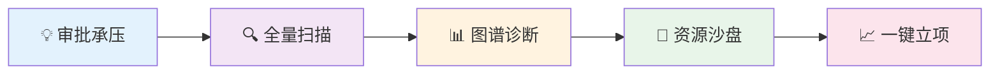

# 科技情报挖掘系统 — 用户画像与用户旅程

---

## 一、三大核心用户画像

### 画像A：科技局决策者（张局长）

| 维度 | 描述 |
|------|------|
| **角色** | 深圳市科技创新局 副局长 |
| **年龄/背景** | 48岁，博士学历，曾任高校科研管理处处长 |
| **核心职责** | 制定全市科技发展战略、审批重大科技计划、统筹人才引进 |
| **典型日常** | 一天有5个会议，用碎片时间了解科技动态，每季度参加一次战略研讨会 |
| **核心痛点** | ❶ 看不清深圳在全球科技中的真实位置 ❷ 人才引进靠"专家推荐+直觉" ❸ 每次决策都缺少数据支撑 |
| **期望** | "5分钟内了解一个领域的全球态势，30分钟内拿到一份有数据支撑的决策参考报告" |

> **用户故事 · 决策10亿科技投资**：下周要向发改委论证10亿级量子计算研究院的立项可行性。过去只能拿宏观趋势和院士背书撑场面，说不清"深圳具体缺哪一块"。现在，张局长在系统中输入战略命题，系统穿透1.5亿文献的底层**引用溯源网络**，精确锁定深圳在"容错算法"层是绝对空白；同时通过**隐含关联挖掘**，发现本土一个青年团队虽然没有与海外顶尖实验室合著论文，却在顶级会议上长年互引互通——这意味着"研究院挂牌即有接盘手"。Agent 30分钟自动生成带溯源的立项论证报告。**从"拿概念要钱"变成"拿实证拍板"**。

### 画像B：科技情报分析师（李研究员）

| 维度 | 描述 |
|------|------|
| **角色** | 深圳市科技情报研究所 高级分析师（也是本系统最核心高频的使用者） |
| **年龄/背景** | 35岁，硕士学历，情报学专业，8年从业经验 |
| **核心职责** | 撰写科技态势月报、追踪技术前沿、为市领导提供随时调用的决策参考 |
| **典型日常** | 每天阅读50+篇论文/资讯摘要，每月产出2-3份深度分析报告，每份报告至少投入2周 |
| **核心痛点** | ❶ 数据散落在WoS/CNKI/专利库等平台 ❷ 手工整合数据耗时巨大 ❸ 无法依靠人力大海捞针发现技术的"隐含关联" |
| **期望** | "一个平台打通所有数据源，AI帮我完成初筛、消歧和报告初稿，我专注于深度研判和定性诊断" |

> **用户故事 · 摸清产业链家底**：省科技厅紧急要求两周内上报《新能源产业链自主可控度白皮书》，直接决定数百亿产业资金走向。李研究员通过**情报规则引擎**快速建立覆盖6大环节的动态监控规则，系统穿透1亿件全球专利，追溯每件专利的根源归属，算出深圳在"电解质"环节的真实占有率仅7%。更意外的是，系统的**隐含关联挖掘**自动触发预警——某日企正通过多国壳公司悄悄包围深圳的核心专利带，且两名关键学者同期离职。这条"挖人+专利围堵"的组合拳，靠人力永远拼不出来。**两周的活，两小时交卷。**

### 画像C：高校头部科研人员（王教授）

| 维度 | 描述 |
|------|------|
| **角色** | 深圳某高校 重点实验室PI，AI辅助新材料方向 |
| **年龄/背景** | 38岁，博士后出站，海归3年，正冲刺国家杰出青年基金 |
| **核心职责** | 发表高水平论文、申请国家级项目、带领团队攻关核心技术卡点 |
| **典型日常** | 每天花大量时间检索交叉学科文献，每周组会听取汇报，努力寻找跨界的国际合作者 |
| **核心痛点** | ❶ 跨学科文献检索存在语言和专业壁垒 ❷ 难以快速定位全球真正"干活"的精准合作者 ❸ 无法快速吃透长篇外文综述 |
| **期望** | "系统能懂我的研究方向，主动推送高价值线索，帮我一键抽取文献核心创新点，让我把时间全花在真正的实验上" |

> **用户故事 · 冲刺国家科研大项目**：王教授申报千万级国家基金重大研究计划，"国际竞争力分析"章节历年是被毙的头号原因。系统穿透材料与计算机两个学科的术语壁垒，通过**引用溯源网络**倒查引用链，找回了3篇博士生完全漏掉的俄文关键论文，理清了该领域共同卡壳的底层瓶颈。更关键的是，在全球团队排位分析中，**隐含关联挖掘**跳过了那些论文产量高但实质交叉浅的"名人"，精准锁定了一位远在德国、极具互补性的青年研究者。**博士生3个月的盲人摸象，系统1小时完成且零盲区。**

---

## 二、三大用户旅程（含系统价值体现）

### 旅程A：张局长 —— "决策10亿科技投资"

| 阶段 | 张局长的行为 | 情报挖掘系统提供的能力 | 💎 系统独特价值 |
|------|-------------|------------------------|----------------|
| **① 审批承压** | 市领导要求出具重大院所的立项依据论证 | 支持自然语言输入战略命题，自动拆解为多个可量化的子检索任务 | 💎 **战略意图秒级解构**——将"该不该建"转化为"实力几何、缺谁、能引谁"的具体检索 |
| **② 全量扫描** | 在系统中发起扫描，对比北京、合肥及美国顶尖实验室 | 基于全量文献与专利，统计对比各阵营的真实核心影响力和转化率 | 💎 **超越人工的颗粒度**——将全球技术力量进行100%覆盖的比对 |
| **③ 图谱诊断** | 查阅卡脖子诊断分析模块 | 通过**引用溯源网络**穿透底层引用链与技术生命周期，精准定位哪一条细分路线是空白但处于红利期 | 💎 **刺破宏观迷雾**——不讲虚的总体排名，直击具体卡脖点的根源归属 |
| **④ 资源沙盘** | 查阅潜在班底可行性测算 | 通过**隐含关联挖掘**计算本土团队与全球目标人才之间的非显性学术连通路径（如互引关系、会议交集等） | 💎 **以数据替代专家背书**——算得出"如果研究院批下来，人究竟能不能聚齐" |
| **⑤ 一键立项** | 审核并导出《量子计算研究院立项论证深度报告》 | Agent整合全量图谱、图表与诊断逻辑，30分钟自动成稿，每条结论附带数据溯源链接 | 💎 **省去两个月的调研起草**——带实证图表溯源的严谨国字号报告 |

> **传统方式总耗时**：各处室调研3周 + 智库座谈2周 + 撰稿1个月 = **2个月+**  
> **本系统总耗时**：提出问题到获取深度分析溯源版 = **不到1小时**

#### 🎬 汇报故事看板：一次10亿级研究院立项的"硬核底牌"
> **场景再现**：市常务会议上，发改委和财政局针对拟筹建的"量子计算研究院"提出了尖锐的立项质询："我们为什么要在这个时候花10个亿建这个研究院？深圳的科研底子到底接不接得住这笔巨量投入？会不会全打水漂？"
>
> **过去（无系统的窘境）**：张局长只能拿出情报所手工熬夜拼凑的PPT——列举合肥和北京都在建，列举量子是未来趋势，邀请了知名院士背书。面对质询，说不清"深圳究竟缺哪一块"以及"核心班底从哪来"，立项被搁置再议，延误一年半载。
>
> **现在（情报挖掘系统的高光时刻）**：张局长在系统中调取了10分钟前刚用Agent生成的可行性论证报告：
> 1. **出示底牌**：系统通过**引用溯源网络**追溯全球量子计算的技术发展链，明确指出——"虽然我们量子测量全国第三，但在'容错核心算法'这一最关键的底层节点上，深圳的被引率极低，属于绝对底盘缺陷，必须建院补足。"这不是拍脑袋的判断，是从底层引用脉络中算出来的。
> 2. **证明承接力**：打开合作网络分析模块，系统的**隐含关联挖掘**揭示了一个传统方式绝对发现不了的事实——深圳某大学的一个青年团队，虽然没有与目标海外实验室合著论文，但在过去三年的顶级会议中形成了密集的"互引互通"网络。"我们有本土接盘手。而且对方实验室有3名核心华裔骨干近期有回流迹象——只要研究院一挂牌，他们就能带着完整技术链入驻。"
> 3. **全据无懈可击**：所有引用的数据，全凭系统的底层链接一一溯源，无一处"拍脑袋"。
> 
> **一听就懂的价值**：系统的终极价值不是提供一堆参考资料给决策者，而是**给重大财政决策提供一套不可反驳的底层逻辑**。把"我们要不要建"，变成了"数据算出来我们必须建，并且资源沙盘显示我们建得成"。

---

### 旅程B：李研究员 —— "摸清产业链家底"

| 阶段 | 李研究员的行为 | 情报挖掘系统提供的能力 | 💎 系统独特价值 |
|------|-------------|------------------------|----------------|
| **① 战略命题** | 接到省厅任务：两周内交出产业链自主可控度白皮书 | 通过**情报规则引擎**，将"新能源产业链自主可控度"自动拆解为6大环节×N个技术节点的动态检索规则矩阵，建立可持续更新的监控框架 | 💎 **复杂命题秒级拆解**——把模糊的政策需求变成可执行的情报分析框架 |
| **② 专利链穿透** | 发起全球专利链扫描 | 基于1亿件消歧专利，穿透每个环节的全球专利归属链，算出"正极材料"环节83%专利属于日韩、"电解质"环节深圳仅占7% | 💎 **专利级的产业体检**——精确到每个环节被谁卡、卡多深 |
| **③ 自主可控测算** | 查阅各环节的自主可控指数 | 通过5000万实体消歧，过滤掉"注水专利"和"僵尸机构"，还原真实的竞争力排名 | 💎 **数据防污染**——过滤注水数据后的结论才经得起答辩 |
| **④ 威胁预警** | 系统弹出红色预警 | **隐含关联挖掘**发现某日企近半年通过壳公司在东南亚密集注册了围绕深圳核心专利带的"包围圈"专利，同时对应方向两位核心学者刚发生离职异动——两个看似无关的事件被系统关联成一张完整的威胁地图 | 💎 **看见暗处的棋局**——把孤立的巧合拼成系统性的威胁预警 |
| **⑤ 白皮书生成** | 审核并导出白皮书 | Agent整合专利链分析+可控指数+威胁预警，2小时自动生成带完整数据溯源的白皮书初稿 | 💎 **两周的活两小时交卷**——每条结论都有专利链接可追溯 |

> **传统方式**：手工查专利库2周 + 请外部咨询机构1个月 + 撰稿2周 = **2个月+，且数据颗粒度不够**  
> **本系统**：命题拆解到白皮书成稿 = **2小时，精确到单个专利的穿透深度**

#### 🎬 汇报故事看板：一份决定数百亿资金流向的"产业体检报告"
> **场景再现**：省科技厅下发紧急通知：要求深圳在两周内提交《新能源产业链自主可控度白皮书》，作为全省"补链强链"专项资金分配的核心依据。这不是一份普通的调研报告——如果分析不到位，深圳可能错失数百亿的省级扶持资金；如果分析有误，巨额资金可能投向已经安全的环节而忽略了真正的致命短板。
>
> **过去（无系统的窘境）**：李研究员只能带着团队分头去各个专利库手工搜索，再去找行业协会要数据。但专利数据鱼龙混杂，大量"注水专利"让可控指数严重失真。更致命的是，没有人能看清跨国企业在暗处的专利包围布局——这些信息分散在几十个国家的专利局数据库里，人力根本无法穿透。两周时间写出来的报告，只能是一份充满"据估算""据业内人士透露"的模糊文件。
>
> **现在（情报挖掘系统的高光时刻）**：
> 1. **快速建规**：李研究员输入产业链分析命题，系统的**情报规则引擎**一秒内将其拆解为6大环节的检索规则矩阵——不是简单的关键词搜索，而是一套包含技术依赖关系和专利归属判定标准的动态分析框架。
> 2. **专利链全景穿透**：系统基于1亿件全球消歧专利，自动穿透固态电池产业链的6大环节，算出每个环节的全球专利归属比例和深圳的真实占有率。结果精确到："硫化物电解质"环节，深圳仅占全球核心专利的7%，且高被引专利全部集中在日本三家企业手中。
> 3. **数据去伪存真**：系统的实体消歧引擎自动识别过滤了大量"注水专利"（同一技术反复拆分申请），将"看起来占30%"的某环节还原为"实际核心专利仅占12%"的真实面貌。
> 4. **暗处的棋局浮出水面**：就在李研究员审阅报告时，系统弹出了一条红色预警——这是整个故事中最震撼的一刻：**隐含关联挖掘**发现某日本车企近半年通过壳公司在马来西亚、印尼密集抢注了一批围绕深圳"电解质界面增强"核心专利的外围保护专利，同时深圳该方向的两位核心学者刚刚发生离职异动。一条"挖人+专利包围"的组合拳被系统完整还原。这些信息分散在不同国家、不同数据库中，看起来毫无关联——但系统把它们拼成了一张完整的威胁地图。
> 5. **2小时交出硬核答卷**：Agent基于以上全部分析，整合成一份《深圳新能源产业链自主可控度白皮书》，含每个环节的可控指数、威胁预警、补链建议，以及每条结论的专利溯源链接。
> 
> **一听就懂的价值**：过去的产业分析靠"据估算+专家意见"，经不起上级的追问。现在，情报挖掘系统能穿透全球1亿件专利，**算出每个产业环节被谁卡着、卡多深、暗处还有谁在布局**。从"模糊的定性判断"到"穿透到单个专利的定量体检"——这就是情报挖掘系统对战略分析师的不可替代价值。

---

### 旅程C：王教授 —— "冲刺国家科研大项目"

| 阶段 | 王教授的行为 | 情报挖掘系统提供的能力 | 💎 系统独特价值 |
|------|-------------|------------------------|----------------|
| **① 重大项目申报** | 准备申报国家基金重大研究计划，需要"国际竞争力分析"章节 | 将研究方向自动拆解为多个细分技术节点，生成结构化的文献检索策略 | 💎 **从模糊方向到精准检索**——不再漏掉关键的交叉学科文献 |
| **② 全球态势扫描** | 发起跨学科文献检索 | 穿透材料与计算机两个学科的术语壁垒，从1.5亿文献中精准召回核心论文；通过**引用溯源网络**倒查引用链，召回传统检索必然遗漏的跨语种根基性文献 | 💎 **跨学科零盲区**——评审专家挑不出"遗漏了XX方向的重要工作" |
| **③ 文献深度研读** | 选中30多篇核心综述，点击"全息研读" | AI伴读直接提取每篇论文的核心发现、实验数据图表、创新点和局限性，结构化中文对比展示 | 💎 **3天苦读变30分钟决策**——精确掌握全球该方向"做到哪了、卡在哪了" |
| **④ 竞争力排位** | 查看该方向的全球团队竞争力分析 | 自动生成全球该方向的团队排位、研究趋势演化、合作网络拓扑；**隐含关联挖掘**跳过高产但浅交叉的名人，精准锁定最具互补性的潜在合作者 | 💎 **数据驱动的竞争力论证**——不仅看清"谁在做"，更发现"谁最值得联手" |
| **⑤ 申请书生成** | 审核并导出"国际研究现状与竞争力分析"章节 | Agent整合文献综述+竞争力排位+团队优势分析，自动生成申请书章节初稿，附带完整引文溯源 | 💎 **评审级别的严谨度**——每条论断都有数据支撑，不再"拍脑袋写综述" |

> **传统方式**：博士生啃文献2个月 + 导师修改1个月 + 质量仍不稳定 = **3个月，且常因"对前沿掌握不够"被毙**  
> **本系统**：从检索到生成申请书章节 = **1小时，穿透深度远超人工**

#### 🎬 汇报故事看板：让千万级国家重点项目不再"倒在综述上"
> **场景再现**：每年国家自然科学基金重大研究计划的申报，是王教授全年最重要的工作。今年他瞄准"AI驱动的高熵合金逆向设计"方向申报千万级项目。申请书中最关键也最难写的章节就是"国际研究现状与竞争力分析"——基金委的评审专家都是该领域的顶级大佬，任何"泛泛而谈"或"遗漏重要工作"都会被一眼看穿，直接毙掉。
>
> **过去（无系统的窘境）**：王教授让3个博士生分头查文献。材料方向的学生不懂计算机的黑话，计算机方向的搜不到材料的关键文献。三个人花了两个月，写出来的综述仍然被王教授批"对国际前沿的把握不够深入"。最致命的是——他需要论证"我们团队在这个方向的国际身位"，但在全屏都是论文的传统数据库里，人工根本算不清全球有多少团队在做、各自做到什么程度了。
>
> **现在（情报挖掘系统的高光时刻）**：
> 1. **跨学科文献精准召回**：王教授输入研究方向后，系统穿透了材料与计算机两个学科的术语壁垒，从1.5亿文献中召回了真正相关的核心文献。关键一步是系统的**引用溯源网络**——它不仅匹配关键词，更沿着引用链倒查到学科交界处那些"被埋没的根基性实验文献"，包括3篇博士生完全没找到的俄文关键论文。
> 2. **30分钟吃透全球进展**：点击"AI全息伴读"，系统不逐字翻译，而是直接把几十篇长篇综述中的"算法表现曲线""实验参数表""局限性结论"结构化提取出来并排对比。30分钟后，王教授清楚地看到：全球该方向目前共同卡在"缺乏高质量实验数据集做模型微调"这一瓶颈上。
> 3. **竞争力排位与差异化发现**：系统自动生成了全球该方向的竞争力排位图——14个主要团队的论文产出、引用影响力、合作网络拓扑。王教授的团队在实验数据积累上全球前三，但在算法端是短板。然而故事的转折在这里：**隐含关联挖掘**跳过了那些论文产量高但实质交叉浅的学术红人，从代码分享平台和学术论坛的交流痕迹中，精准锁定了一位远在德国、正急需高质量实验数据做模型微调的青年算法专家——王教授团队恰好拥有的实验数据正是对方最渴望的资源。这不是传统"找大牛挂名"的合作，而是真正的资源互补、强强联手。
> 4. **申请书章节自动生成**：Agent基于以上分析，自动生成了一份"国际研究现状与竞争力分析"章节初稿，包含全球态势综述、竞争力排位、团队差异化优势论证，每条论断都附带引文溯源。
> 
> **一听就懂的价值**：对于顶尖科研人员，国家重大项目的申报成功率极低。被毙的头号原因就是"对国际前沿掌握不够"。情报挖掘系统**把博士生要做3个月的文献调研工作压缩到1小时，且穿透深度远超人工**——让科学家把100%的精力放在真正的科学创新上，而不是被信息搜索的苦力活消耗殆尽。

---

## 三、系统价值汇总矩阵

| 价值维度 | 张局长感知（定方向） | 李研究员感知（出谋略） | 王教授感知（做突破） |
|:--------:|:---------:|:-----------:|:---------:|
| **数据壁垒** | 基于全球科技地图进行顶层决策 | 跨1.5亿论文+1亿专利进行特征比对 | 使用涵盖40+语种原文的语义库 |
| **效率革命** | 决策周期：6周 → 1小时 | 报告分析：12天 → 半天 | 文献研读：3天 → 30分钟 |
| **情报穿透** | 看清技术差距与真实实力排名 | 洞察合作异动与隐蔽的研发信号 | 捕捉学者研究兴趣的漂移轨迹 |
| **AI生产力** | 自动推送"懂深圳"的人才画像 | 情报流7×24值夜班，写报告初稿 | 自动秒读长篇外语综述提炼图表 |

---

## 四、核心结论：不可替代的"新质生产力引擎"

> [!IMPORTANT]
> 这套情报挖掘系统的创新内核在于三大独有能力的有机协同：
> - **情报规则引擎**：将模糊的战略命题自动转化为可执行的动态分析框架，让非技术背景的决策者也能发起专业级的情报任务
> - **引用溯源网络**：沿引用链深度穿透到知识的源头节点，看清表面数据背后的真实归属与技术依赖关系
> - **隐含关联挖掘**：从看似无关的孤立事件中发现系统性的威胁或机遇，这是纯人力永远不可能完成的工作

1. **从"信息垃圾场"到"认知过滤网"**：过去的数据平台给你2万条搜索结果让你自己找，本系统用千万级消歧、聚类与大模型分析，直接把最重要的18个事实和1份初稿放在你桌上。
2. **从"信息孤岛"到"全要素神经网"**：专利、论文、机构不再是独立的存在。它们在底层的图谱编织下，能计算出"哪些论文支撑了专利"、"哪个专家正在偷偷转行"。这是传统数据库不可能具备的降维打击。
3. **把时间用在刀刃上**：
   - 决策者不用再拍脑袋，可以对着清晰的底牌做判断。
   - 分析师不用再做复制粘贴的苦工，可以去做情报的定性研判。
   - 科学家不用再整屏整屏地啃外文废话，可以直接看最高纯度的创新点。

> **汇报金句展望**：基于这套包含 **3亿+文献、1亿+专利、5000万+消歧实体** 的情报引擎大脑，全市数十万乃至全国的科技工作者，将省去每年数百万小时的"无效检索与阅读时间"。情报挖掘系统，就是科研创新的**"加速器"**，产业发展的**"指南针"**，和政策决策的**"定盘星"**。
