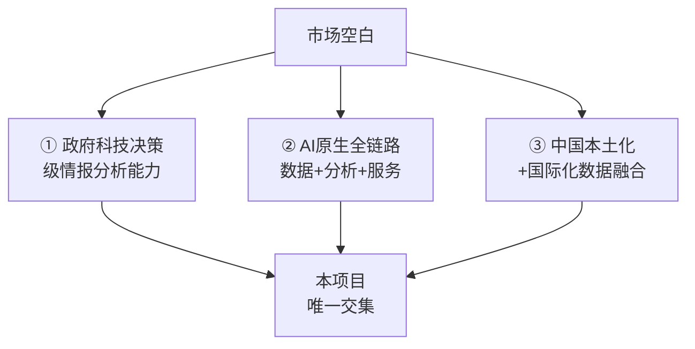

# 科技情报挖掘与知识服务系统 — 竞品分析报告

> **项目背景**：深圳市科技创新局国际科技信息中心项目（SZCG2025001150）  
> **分析范围**：科技情报挖掘与知识服务子系统  
> **分析日期**：2026-03-04  

---

## 一、市场全景概述

科技情报挖掘与知识服务是学术科研基础设施的核心组成部分。当前全球市场参与者可分为四大梯队：

| 梯队 | 代表产品 | 特征 |
|------|----------|------|
| **商业巨头** | Web of Science/InCites、Scopus、Dimensions.ai | 数据权威、功能完善、价格高昂、闭源生态 |
| **AI原生平台** | AMiner、Semantic Scholar、Elicit、ResearchRabbit | AI驱动、用户体验好、部分免费、创新快 |
| **开放数据平台** | OpenAlex、Lens.org、Connected Papers | 开源/开放、社区驱动、功能聚焦 |
| **国内学术平台** | CNKI、万方数据、知因分析、NSTL | 中文资源强、政府关系深、国际化不足 |

---

## 二、重点竞品深度分析

### 2.1 AMiner（清华大学）

| 维度 | 详情 |
|------|------|
| **数据规模** | 3.2亿+论文、1.35亿+学者、4000万+专利、200万+资讯 |
| **核心能力** | GLM大模型驱动的学术搜索与分析，学者消歧系统 |
| **AI功能** | ChatPaper智能阅读、AI文献库对话、AI辅助写作、趋势分析 |
| **独特优势** | 清华背景、中国最大学术AI平台、学者画像技术成熟 |
| **不足** | ❌ 无政府决策支持能力 ❌ 无数据社区功能 ❌ 缺乏情报规则引擎 |

### 2.2 Semantic Scholar（Allen AI研究所）

| 维度 | 详情 |
|------|------|
| **数据规模** | 2亿+学术论文 |
| **核心能力** | TLDR自动摘要、Semantic Reader增强阅读、个性化研究推送 |
| **AI功能** | "Ask This Paper"论文问答、AI高亮（Goal/Method/Result分类） |
| **独特优势** | 免费开放、API生态完善、阅读体验行业领先 |
| **不足** | ❌ 无专利数据 ❌ 无中文优化 ❌ 无多模态解析 ❌ 无政府场景 |

### 2.3 Web of Science InCites（Clarivate）

| 维度 | 详情 |
|------|------|
| **数据规模** | 核心合集覆盖顶尖期刊，80+评估指标 |
| **核心能力** | 科研绩效评估、机构对标分析、合作关系分析 |
| **AI功能** | Research Horizon Navigator™（新兴研究领域发现） |
| **独特优势** | 权威性最高、指标体系最完善、政府机构广泛采购 |
| **不足** | ❌ 价格极高 ❌ 无AI深度交互 ❌ 封闭生态 ❌ 无情报主动推送 |

### 2.4 Dimensions.ai（Digital Science）

| 维度 | 详情 |
|------|------|
| **数据规模** | 1.59亿+出版物、790万科研基金、1.7亿专利、93.8万临床试验 |
| **核心能力** | 跨数据类型互联（从研究到影响的全链路）、AI智能摘要 |
| **AI功能** | Dimensions Research GPT（基于证据的AI问答）、多语言AI摘要 |
| **独特优势** | 数据类型最广（含基金、临床试验、政策文件）、AI整合深度强 |
| **不足** | ❌ 高级功能付费 ❌ 元数据缺失率较高 ❌ 无专门的政府决策场景 |

### 2.5 Elicit AI

| 维度 | 详情 |
|------|------|
| **数据规模** | 1.38亿论文、54.5万临床试验 |
| **核心能力** | Research Agents自动化科研、严格筛选模式、自动文献综述 |
| **AI功能** | Claude Opus驱动的数据提取、80篇论文综合Brief、自动化检索工作流 |
| **独特优势** | 自动化科研流程的先驱、句子级引用溯源、幻觉率极低 |
| **不足** | ❌ 纯英文 ❌ 无社区功能 ❌ 无知识图谱 ❌ 无政府场景适配 |

### 2.6 OpenAlex

| 维度 | 详情 |
|------|------|
| **数据规模** | 最大开放研究数据库，1.9亿+研究成果 |
| **核心能力** | 完全开放的学术元数据、标准化引文指标、用户策展 |
| **API使用** | 每月15亿+API调用（超越Crossref） |
| **独特优势** | 完全免费开放、社区驱动、数据可自由获取和使用 |
| **不足** | ❌ 无AI分析功能 ❌ 无可视化工具 ❌ 纯数据层无应用层 |

### 2.7 CNKI科技情报分析服务平台

| 维度 | 详情 |
|------|------|
| **数据规模** | 中国最大学术数据库（中文文献覆盖率最高） |
| **核心能力** | 技术雷达、竞争情报、AI智能创编助手 |
| **AI功能** | CNKI AI（基于中华知识大模型的增强检索/辅助研读/辅助创作） |
| **独特优势** | 中文学术文献垄断地位、政府机构广泛用户基础 |
| **不足** | ❌ 国际化数据弱 ❌ AI能力相对初级 ❌ 无数据社区 ❌ 无学者消歧 |

### 2.8 其他竞品速览

| 平台 | 核心特色 | 关键不足 |
|------|----------|----------|
| **万方数据** | 万方智库/选题/分析工具，知识图谱可视化 | 数据规模有限、AI能力弱 |
| **ResearchRabbit** | 可视化文献发现、引用图谱探索、2.8亿+学术源 | 无分析功能、无数据处理 |
| **Connected Papers** | 论文关系图谱可视化（共被引/书目耦合） | 功能极度聚焦、免费受限 |
| **Lens.org** | 1.11亿专利+2亿学术记录、免费开放 | 无AI功能、界面较旧 |
| **NSTL** | 多类型文献全面收藏、AI辅读、智能综析 | 更新慢、界面体验差、无社区 |
| **知因分析** | 开源科技情报平台、技术态势分析 | 数据量不足、生态不成熟 |

---

## 三、功能维度对比矩阵

| 功能维度 | AMiner | Semantic Scholar | WoS InCites | Dimensions | Elicit | 本项目标书要求 |
|----------|:------:|:----------------:|:-----------:|:----------:|:------:|:-------------:|
| **论文元数据（亿级）** | ✅3.2亿 | ✅2亿 | ✅核心集 | ✅1.59亿 | ✅1.38亿 | ✅3亿+ |
| **专利数据** | ✅4000万 | ❌ | ❌ | ✅1.7亿 | ❌ | ✅1亿+ |
| **学者画像** | ✅成熟 | ⚠基础 | ⚠统计 | ⚠统计 | ❌ | ✅多维300万+ |
| **学者消歧** | ✅ | ❌ | ❌ | ❌ | ❌ | ✅5000万+ |
| **跨语言翻译** | ❌ | ❌ | ❌ | ⚠AI摘要 | ❌ | ✅40+语言 |
| **多模态解析** | ⚠PDF | ⚠PDF | ❌ | ❌ | ⚠PDF | ✅图/文/代码/视频 |
| **AI论文阅读** | ✅ChatPaper | ✅SemanticReader | ❌ | ❌ | ✅强 | ✅ |
| **引用溯源分析** | ⚠基础 | ⚠基础 | ❌ | ❌ | ❌ | ✅多层网络+可视化 |
| **知识图谱** | ✅科技图谱 | ❌ | ❌ | ❌ | ❌ | ✅亿级 |
| **合作网络分析** | ⚠ | ❌ | ✅强 | ⚠ | ❌ | ✅学者+机构+引用 |
| **数据社区** | ⚠数据集 | ❌ | ❌ | ❌ | ❌ | ✅完整社区 |
| **政府决策支撑** | ❌ | ❌ | ⚠间接 | ⚠间接 | ❌ | ✅核心场景 |
| **MCP工具** | ❌ | ❌ | ❌ | ❌ | ❌ | ✅20+工具 |
| **Agent智能体** | ❌ | ❌ | ❌ | ❌ | ✅Research Agent | ✅ |

> **✅** = 完整支持 | **⚠** = 部分支持 | **❌** = 不支持

---

## 四、市场空白与竞争机会分析

### 4.1 核心发现：没有竞品能同时满足以下三个条件



### 4.2 六大市场空白领域

| # | 空白领域 | 现有竞品状况 | 本项目机会 |
|---|----------|-------------|-----------|
| 1 | **政府科技战略决策支持** | 所有竞品均面向研究者，无一面向政府决策者 | 融合情报挖掘与决策推荐的唯一平台 |
| 2 | **MCP协议驱动的情报Agent** | 无竞品采用MCP标准 | 首个基于MCP的科技情报智能体生态 |
| 3 | **超大规模学者消歧（5000万+）** | AMiner最成熟但未达此规模 | 全球最大规模消歧引擎 |
| 4 | **多模态科技情报解析** | 所有竞品仅支持PDF文本 | 图片+文本+代码+视频全模态解析 |
| 5 | **面向政府的科研数据社区** | 无面向政府/机构的数据社区 | 政企学研一体化协作平台 |
| 6 | **情报规则引擎+自动生成** | 无竞品具备可配置规则引擎 | 人机协同的情报发现范式 |

### 4.3 技术趋势对齐分析

2025年科技情报领域的四大技术趋势，本项目全部对齐：

| 趋势 | 行业动态 | 本项目响应 |
|------|----------|-----------|
| **大模型+RAG** | 各平台纷纷接入GPT/Claude进行文献交互 | 自有科技情报大模型 + 1.5亿文献语义召回 |
| **AI Agent** | Elicit首推Research Agent，尚为单一场景 | 预置30+ APP + 20+ MCP工具的完整Agent生态 |
| **知识图谱+LLM融合** | 趋势明确但落地者少 | 亿级知识图谱 + 大模型双轮驱动 |
| **MCP协议生态** | 2025年最具影响力的AI互操作标准 | 首批在政务领域落地MCP的项目 |

---

## 五、竞争定位与差异化策略

### 5.1 战略定位

> **全球首个面向政府科技决策的AI原生科技情报挖掘与知识服务平台**

与所有竞品的根本区别：

| 竞品定位 | 本项目定位 |
|----------|-----------|
| 面向个人研究者的**检索工具** | 面向政府决策的**情报中枢** |
| 被动式信息获取 | 主动式情报推送+预警 |
| 单一数据类型 | 论文+专利+资讯+学者+机构全要素 |
| AI作为辅助功能 | AI作为平台核心引擎 |
| 封闭商业模式 | 开放数据社区+政企协作 |

### 5.2 核心差异化价值

```
1. 唯一性：全球唯一面向政府科技决策的AI原生情报平台
2. 规模性：3亿+论文 × 1亿+专利 × 300万+学者的全要素知识库
3. 智能性：大模型+知识图谱+Agent+MCP的四位一体智能架构
4. 全链路：获取→预处理→分析→服务→社区的端到端闭环
5. 开放性：MCP协议驱动的开放智能体生态
6. 创新性：情报规则引擎+隐含关联挖掘+引用溯源网络
```

---

## 六、结论

本项目在科技情报挖掘领域具有明确的**差异化竞争优势**，核心壁垒在于：

1. **场景独占**：面向政府科技决策的情报服务，是所有竞品完全空白的市场
2. **技术领先**：MCP + Agent + 大模型 + 知识图谱的四位一体架构，代表2025年最前沿技术方向
3. **数据壁垒**：3亿论文 + 1亿专利 + 5000万学者消歧的超大规模数据资产
4. **生态优势**：开放数据社区 + MCP工具生态 + 政企学研协作网络

> [!IMPORTANT]
> 以上竞品分析的核心结论：**市场上不存在任何一个同时满足"政府决策导向 + AI原生引擎 + 全要素数据融合 + 开放协作生态"四个条件的竞品**。本项目填补的是一个真正的市场空白，而非在已有赛道上的追赶。
